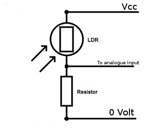

# Communication laser

## Ressources nécessaires
1. Module laser: Un pointeur laser de 5mW 650nm (LED avec 100 ohms en série).
2. Transformateur de sortie audio: un transformateur 8 ohm: 1Kohm (peut être tiré à partir d'un équipement audio).
3. Sources d'alimentation: Utilisez 3,3V pour pointeur laser et 2V pour casque (piles AA normales feront).
4. Photo Résistance (photo-diodes ou des détecteurs IR fonctionnent également).
5. Paire de casque (haut parleur) et une source audio (ordinateur ou téléphone portable).
6. Audio jack 3,5 mm

## Tension d'alimentation du laser

Avec une tension d'alimentation $V_{cc}$ et une tension de diode laser $V_f$ de 3V la tension aux bornes de la résistance réductrice est de $(V_{cc}-V_f)$V et sa valeur est calculée par $R= \frac{(V_{cc}-V_f)}{I_f}$ soit $R= \frac{(V_{cc}-3)}{0,04}$ ...

## Choisissant une résistance pour un LDR: formule Axel Benz

Une façon de calculer une résistance appropriée est d'utiliser ce qu'on appelle la formule Axel Benz, qui est que la résistance doit être la racine carrée des résistances de la photorésistance minimum et maximum multiplié ensemble.

$$ R_{ref}= \sqrt{R_{min} * R_{max}}$$

