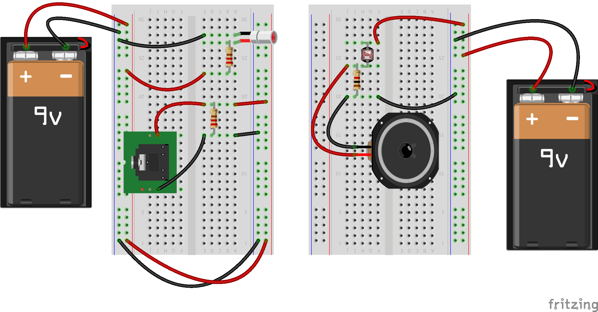

# Communicateur laser

## Ressources nécessaires
1. Module laser: stylo pointeur laser de 5mW 650nm / LED avec 100 ohms en série.
2. Audio Transformateur de sortie: un 8 ohm: 1K transformateur ohm / peut être tiré à partir d'un équipement audio.
3. Sources d'alimentation: Utilisez 3.3V pour pointeur laser et 2V pour casque (piles AA normales feront).
4. Photo Résistance (photo-diodes ou des détecteurs IR fonctionnent également).
5. Paire de casque et audio Source
6. audio jack 3,5 mm

dzd